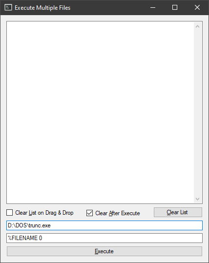

# Drag And Drop Multiple Files
Run a command line program on multiple files via drag and drop

Requires .net 4.7

Remembers the path to the exe and the parameters.

Replaces the filename parameter from the program to be run with %FILENAME in the parameters
